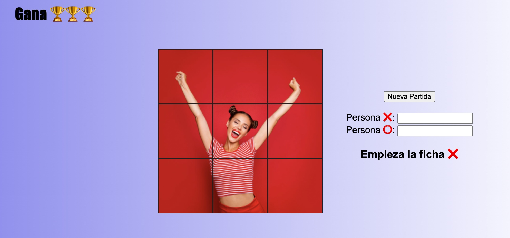
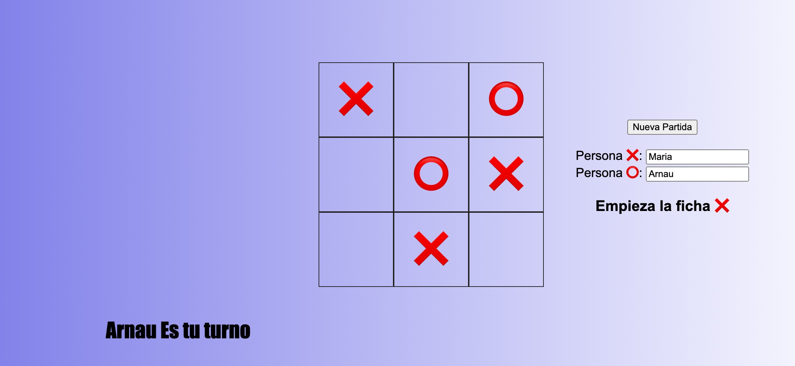

# Juego tres en Raya. Responsive.

## Contenido

- [Saber Más](#about)
- [Instalación](#getting_started)
- [Uso](#usage)

## Saber Más 

Juego del tres en Raya. La ficha X es la que empieza en primera posicion. Podemos hacer reset en qualquier momento. Nos dira en el turno que estamos. Podemos introducir los nombres de las personas que juegan. Y el juego no comunicara el nombre de la persona ganadora.
## Instalación

Para la instalación de esta web no se requiere ningun requisito previo.

### Vista previa

Responsive 100%

Diseño Limpio

Gran Capacidad de personalización

## Uso 

Se pueden cargar las fotos personalizadas para cada tipo de jugada.
